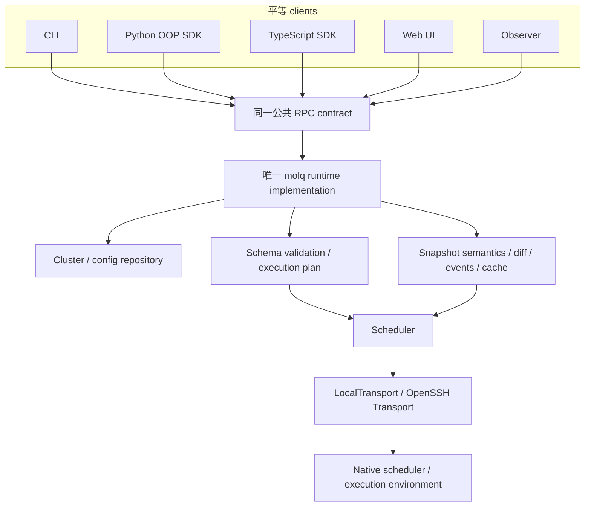

# Spec: molq 0.9.0 单一 runtime、公共 RPC 与任务 schema

状态：0.9.0 已实施合同。日期：2026-10-07。约束来源：[现行 50 条原则](molq-1-0-principles.md)。
本文是唯一实现设计入口；已按 0.9.0 breaking release 落实，取代此前 RPC/daemon、server/Web、部署与语言四份并行草案。验收记录见 [implementation ledger](implementation-0-9-0.md)。
原则为已确定约束；0.9.0 的精确字段、方法、请求/结果类型以 src/molq/protocol/v1.json 为准。本文的示意不另立协议；生成类型和测试共同验证该合同。

## Summary

molq 的业务只在一套 Runtime 中实现。Runtime 解释任务 schema、组织执行计划、管理 Cluster/config persistence，并统一 snapshots、diff、cache 与 events。Scheduler 负责准确渲染请求、执行原生操作及标准化原生状态。CLI、Python SDK、TS SDK、Web UI、Observer 是同一公共 RPC 的平等 clients；部署位置与 stdio/HTTP/WS 不产生第二套实现。没有 capability 层；静态校验通过后，实际资源请求仍由原生调度器接受或拒绝。Observer 只决定何时采样、怎样通知。Job 是一次 allocation，Execution 支持简单单元与显式多单元组合。

## Design

### 1. 单一实现与依赖边界（原则 1–16、45–50）



本文的 `Scheduler` 指 molq 内的实现抽象及其 `SlurmScheduler`、`PBSScheduler`、`LSFScheduler`、`ShellScheduler` 实现；“原生调度器 / native scheduler”指 Slurm、PBS、LSF 等外部系统。ShellScheduler 面向没有批调度器的目标执行环境。
正常部署是一个 registry 对应一个 active Runtime；需要共享 cache、events、cursors 和 observation state 的 clients 连接同一 endpoint。无常驻 Runtime 的 native 使用通过临时 stdio Runtime 访问 registry。不同 registry 可以部署独立实例，但多个 active Runtime 共享同一 registry 不是正式部署模型。
RPC server 是 Runtime 的入口；domain/protocol/services/registry/persistence/observation/scheduler/transport/RPC adapters 都是同一进程内的普通模块。模块间不增加服务进程或 RPC 边界，不再增加通用 engine/controller/core。

| 所属 | 允许实现 | 禁止实现 |
|---|---|---|
| runtime | defaults merge、schema interpretation、schema 校验、执行计划、Scheduler 调用、registry、snapshot diff/events；Scheduler 模块独占资源映射与原生渲染/操作/状态标准化 | 在 SDK/Observer/Web 再复制这些能力 |
| clients | codec/连接、生成的 DTO、单位值构造、语言 façade、CLI/UI、上传 client 文件、用户显式前台刷新、client-local 连接/观察/通知配置 | 原生 scheduler subprocess、SSH/rsync、Runtime SQL、独立任务状态机、native flags 映射 |
| Observer | cadence/Cluster-batch 调度、请求 sample、消费 runtime events、notification/backoff | snapshot比较、terminal normalization、Job lifecycle diff、Runtime 数据库或 Scheduler/Transport 访问 |

公共 protocol schemas/catalog 是唯一协议定义来源。尽量从它生成 Python/TS DTO 与 wire client；手写层只提供语言习惯 façade。clients 可以共享生成的 codec/types，不通过另一个 client 的业务命令、输出或 OOP façade转发。
Web UI 的 browser wire层可复用生成的 TS protocol client，Observer同样直接使用公共contract；这不授予它们高于SDK/CLI的能力。
Client-local 连接、采样频率与通知路由配置属于该 client，可由 client 自行加载；这不授予它读取或修改 Runtime registry/SQLite 的权限，也不允许在 client 中持久化另一套 Job lifecycle。公共 config/presets RPC 只管理 Runtime-owned 配置。
CI 用依赖规则禁止 clients/Observer import runtime services、scheduler、transport、persistence；runtime 不 import client façades。所有语言运行同一 conformance fixtures，protocol 不依赖 Python 类/pickle。

### 2. 部署不是第二套架构（原则 7–11）

| 模式 | 调用路径 | 生命周期 |
|---|---|---|
| 本机无常驻程序 | native client → stdio RPC → 临时同一 runtime | 命令/Molq session结束后退出 |
| 本机共享入口 | clients → loopback HTTP/WS → 同一 runtime | 长期API服务；不自行周期扫描 Cluster |
| HPC login node | clients → RPC → runtime → LocalTransport → native scheduler | 本机用户/原生 scheduler 身份；DB选实际本地磁盘 |
| 独立管理节点 | clients → HTTPS/WSS → runtime → OpenSSH → native scheduler | SSH配置、凭据与alias属于runtime host |

0.9.0 入口为 `molq runtime serve`、`molq runtime rpc --stdio` 和 `molq --endpoint ... observer`。
网络 listener 只是 Runtime 的入口，Observer 是 RPC client。
0.9.0 Native client 没有显式 endpoint 时启动临时 stdio Runtime；有 endpoint 时只连接该 Runtime。不自动探测服务、不在 auth/version/registry mismatch 时 fallback，mutation dispatch 后断连不换实例重发。需要共享观察状态的 clients 明确连接同一 endpoint。
网页需要可访问的网络runtime，Observer可选；native stdio不等于client直接调Scheduler。临时runtime/stdout只传协议，stderr诊断；EOF有限排空已dispatch操作，accepted计算与辅助进程清理范围分开。
Runtime停止不关闭用户的SSH master，也不终止已被原生 scheduler 接受的计算。ShellScheduler 需用目标端launch/exit证据使accepted任务脱离调用进程存活。

### 3. 公共 RPC 与用户体验（原则 2–6、10–11）

采用 JSON-RPC 2.0 envelope 与 `protocol/v1.json` schemas/catalog。JSON-RPC定义与传输独立。[JSON-RPC规范](https://www.jsonrpc.org/specification)、[JSON Schema参考](https://json-schema.org/understanding-json-schema/reference)

| 契约 | 建议 |
|---|---|
| 普通请求 | HTTP POST /rpc、WS消息或stdio UTF-8 LF envelope/batch，共用dispatcher；建议max1MiB |
| Streaming | events.subscribe用WS/stdio；普通HTTP返回RPC_CHANNEL_UNSUPPORTED，不改变业务定义 |
| 协议握手 | molq.hello 返回 major/minor/schema_version、registry_id、runtime_instance_id、methods/catalog、limits；仅描述协议/接入，不进行 Scheduler 或 Cluster 功能协商 |
| 身份 | runtime认证与RequestContext，所有 registry/cache/Scheduler 操作先授权；首发一个OS/HPC身份对应一个runtime实例 |
| 兼容 | optional字段/method可加；删除/变义需新major；opaque native IDs为string，时间RFC3339，memory_bytes十进制string |
| Mutations | 必须request id/结果或outcome unknown；JSON-RPC batch不等于事务，get_many/cancel_many逐项result/error |
| 核心方法 | clusters list/get/register/update/remove；jobs validate/submit/get/get_many/list/history/cancel/cancel_many/observe；events subscribe；logs read；config/presets读写；schema/discover |
| 文件能力 | 通过runtime files RPC，有限chunk/offset；没有 Web 私有 staging/Scheduler 接口 |

`jobs.validate` 只验证 schema 内部一致性及所选 Scheduler 能否准确表示，可返回规范化 Spec 和诊断；`jobs.preview` 如提供，必须使用同一 Scheduler renderer。校验不探测资源、队列、权限或 MPI/MPS 环境，也不保证原生调度器会接受。提交时重新校验并捕获配置 revision。
Python提供Molq/Cluster/Job/JobCollection，同步/async façades同语义。示意：

```python
with Molq(endpoint=endpoint) as mq:
    cluster = mq.cluster("gpu")
    job = cluster.submit(argv=["python", "train.py"])
    observation = job.status(consistency="live")
    result = job.wait(timeout=3600)
```

简单argv façade只做类型投影，发送单ExecutionUnit，不能在SDK合并defaults、猜环境或生成script。Job/Collection持有registry限定的refs，runtime返回terminal/completion语义，client不再硬编码一份状态解释规则。
CLI默认JSON/stream NDJSON，稳定envelope/exit/error kind、无TTY/无交互、discover/schema；本次不保留 table/TUI。输入错误/缺runtime也有同样error schema，Agent不解析Rich或native stderr。
核心能力三语言client等价，Web UX可逐步扩展但不增加另一套业务语义；CLI不高于SDK。client关闭只结束自身前台观察/连接，不cancelJob。

### 4. Cluster：计算目标，不设capability层（原则 23–27）

ClusterDefinition 仅持久化目的地信息：stable cluster_id/name、Scheduler binding、Transport kind、适用时的 SSH alias、defaults、必要的 site-specific Scheduler/rendering 配置与 target paths。名称变化保留 ID；计算目标或 Scheduler binding 改变则使用新 ID。
ClusterDefinition 与 Cluster persistence 均不包含 monitor preferences、observation cadence、notification preferences 或 polling interval。这些策略属于 Observer/client 配置；Web、前台 wait 与后台 Observer 可以用不同频率观察同一 Cluster，没有 Cluster 级共享轮询间隔。
没有Cluster capability清单、supports_* matrix、能力协商/RPC，也不把 Scheduler 名字转换成自动推断的 Cluster 能力。禁止用 support matrix object、feature registry、SchedulerCapabilities class 或 Cluster feature set 重建该层；仅文档与 conformance tests 可列出各 Scheduler 已实现的 schema 特性。

Runtime按两个层次验证：任务schema合法且自身资源/execution组合一致；所选 Scheduler 能够准确渲染该请求。Scheduler 无法准确表示时返回结构化SCHEDULER_UNSUPPORTED，不把字段丢掉、换一种机制或仿真。
资源是否真正存在、权限/队列限制、MPI/MPS实际配置是否接受这次请求，由原生调度器接受或拒绝。验证通过只表示输入与渲染合法，不是运行环境探测成功或资源可用保证。
必要的 Scheduler 实现参数（例如既定launcher绑定）属于明确配置，不能扩展成另一份feature清单或在Job里暴露nativeflags。没有正确绑定就报错，不probe PATH/试命令选机制。
普通livequery询问任务真实状态是必要操作，不是能力发现；ssh -G仅在明确诊断调用时展示OpenSSH有效配置，不自动修改Cluster或推断高级功能。
Cluster解析只读registry，未知name报错，不变成alias或本机。默认不复制HostName/IdentityFile/ProxyJump/ControlPath；用户显式override若需要另定typed字段/allowlist/优先级，不能自动注入诊断快照。

### 5. Job schema：allocation与execution units（原则 33–40）

Job 代表一次原生 scheduler allocation；ExecutionUnit是allocation内的一个程序/启动单元，不是新的molqJob。多个units只产生一个allocationJobRef，不在数据库建立多个子Job生命周期。

| 模型 | 语义 |
|---|---|
| JobSpec | cluster_ref + Resources + Scheduling + Execution；runtime解释/标准化，不含native scheduler flags |
| Resources | allocation申请：CPU/节点布局、memory、time_limit、accelerators；资源单位/scope明确 |
| Scheduling | partition/account、priority/QoS等领域意图、typed native-job dependency；不保存原生dependency字符串 |
| Execution | defaults环境/target cwd、非空units、可选组合plan；allocation内部运行什么 |
| ExecutionUnit | stable unit_id、command union argv/shell_command/script、env/cwd/output、可选launch/placement |
| ExecutionPlan | UnitRef / Sequence(children) / Parallel(children)；表达allocation内关系，不是跨Job DAG/workflow |
| LaunchSpec | 可选direct/mpi等领域启动意图，MPI ranks/threads等；不放srun/mpirun原生命令选项 |
| UnitPlacement | 可选描述如何使用allocation内已有CPU/accelerator份额；不申请第二个allocation、不以env代替资源申请 |

最小canonical wire例子（field naming待schema冻结）：

```json
{
  "cluster": "cpu",
  "execution": {
    "units": [{"id": "main", "command": {"kind": "argv", "argv": ["python", "work.py"]}}]
  }
}
```

单unit省略plan，runtime视为UnitRef(main)；Resources/Scheduling可省略并由runtime统一合并已配置defaults。简单Job不需要MPI/MPS/多单元字段。
多个unit必须给显式plan，不能按list顺序猜并行。示意的“一次allocation，预处理→两程序并行→汇总”：

```yaml
execution:
  units:
    - {id: prepare, command: {kind: argv, argv: [python, prepare.py]}}
    - {id: a, command: {kind: argv, argv: [python, a.py]}}
    - {id: b, command: {kind: argv, argv: [python, b.py]}}
    - {id: report, command: {kind: argv, argv: [python, report.py]}}
  plan:
    kind: sequence
    children:
      - {kind: unit, ref: prepare}
      - kind: parallel
        children: [{kind: unit, ref: a}, {kind: unit, ref: b}]
      - {kind: unit, ref: report}
```

首发最小语义建议：sequence首个失败后不启动后续；parallel等待已启动分支结束，按plan稳定次序合成失败退出码，全部成功才继续后续sequence。不新增自动retry、任意condition语言、跨allocation依赖执行器或后台execution controller。
unit id唯一；plan所有引用存在、每个unit恰好出现一次、树深度/unit数有界；没有重复运行同一unit的隐式loop。资源使用/placement须符合allocation预算与Scheduler约束，不能silentoversubscribe；Scheduler无法精确表示的组合报错。
MPI launch由所选Scheduler及明确launcher绑定渲染，不以试mpirun/srun决定机制。普通direct执行使用生成的allocation内脚本；特殊launcher与native step语义都在Scheduler。渲染复用runtime内部ExecutionPlan模块，不能在client再造plan interpreter。
生成的wrapper/script随allocation运行、记录必要exit证据，不是一个新的molq服务或durable workflow engine。HPC JobState 仍由原生 scheduler/accounting 确认，不以某个unit的client-side状态直接推断allocation终态。
公共Job schema没有extra_directives、raw dependency、opaque native submit options/flags 等后门。Scheduler内部配置只管实现绑定与映射，不把native syntax暴露为任务公共字段。
用户可提供普通payload shell/script及任意合法env；它们描述运行程序，不作为用户手写原生调度脚本的标准接口。常见MPI/多程序场景被迫写sbatch/srun脚本时，应补schema与Scheduler；不会以“写shell即可”宣称正式支持。

### 6. 原生调度器管理的 NVIDIA MPS 与普通 Execution（原则 41–44）

Resources中的accelerator request采用typed union，示意：

```yaml
resources:
  accelerators:
    - {kind: nvidia_mps, quantity: 20, scope: per_node}
execution:
  units:
    - {id: main, command: {kind: argv, argv: [python, train.py]}}
```

quantity 是 schema 规定、Scheduler 准确映射的原生调度器资源单位，不是runtime自行分割GPU，也不默认等于20%的物理GPU。具体单位/粒度/scope在资源schema与Scheduler合同中定义；GPU与MPS组合无法被准确表达时拒绝，不隐式转换。

| 场景 | runtime行为 |
|---|---|
| 请求 nvidia_mps，Scheduler 有准确映射 | 渲染原生 scheduler resource；实际存在/数量/权限由原生调度器判断 |
| Scheduler没有MPS资源映射 | SCHEDULER_UNSUPPORTED，不fallback到用户MPS进程 |
| 原生调度器未配置 MPS 或拒绝资源申请 | 返回原生拒绝/不确定结果，不创建MPS代理或改请求 |
| 用户自行启动MPS或设置CUDA/MPS env | 普通Execution command/env；不赋予原生调度器资源/隔离保证 |

Slurm确实可以由管理员配置MPS GRES；molq只发送正式资源请求，不检查配置以建立capability清单，其他Scheduler不能准确表达时拒绝。[Slurm GRES/MPS官方文档](https://slurm.schedmd.com/gres.html)
runtime、Observer和SDK均不因资源字段自动启动nvidia-cuda-mps-control、不提供MPSdaemon/connection manager、不模拟原生调度器没有提供的资源；MPS 请求失败也不改为整卡 GPU 请求。

### 7. Native scheduler truth、统一 observation 与 Observer（原则 12–19）

Scheduler 负责 queue/accounting 查询、原生状态到 canonical 状态的标准化；ShellScheduler 读取目标端 launch/exit receipt。Runtime 组装 JobSnapshot、QueryCoverage/freshness，并依据统一 canonical 语义计算 terminal/completion、diff 与 events。JobRef=(registry限定ClusterID, opaque nativeID, 可验证incarnation)。nativeID复用不匹配拒绝mutation，无法确认历史身份报错；rename不重指Job。
query明确found/absent/unavailable；accounting滞后/权限失败/partial分页不能推断终态。cancel返回accepted/already_terminal/rejected/unknown，accepted不表示cancelled；network失败不存LOST/FAILED。
JobSnapshot包含source/observed_at/freshness及runtime计算的terminal；集合completion由runtime计算，只在refs都被确证终态时all_confirmed_terminal=true。SDK/Observer不保存一套terminal-state映射。

新增有限单次采样公共方法 `jobs.observe`，输入Cluster与明确scope/refs、前次cursor；不在runtime自主开启periodicloop。
它复用query/cache/统一diff，必要时对上次已知但本次queue消失的refs做accounting，返回snapshots、coverage、runtime生成changes、completion与下次cursor。普通 query 和 observe 复用同一 snapshot/completion 实现；events 由有 cursor 的 observe 统一生成，不另写“Observer diff”。
第一轮或baseline/cursor丢失返回snapshot+resync，不把已有terminal当新完成；partial/unavailable不产生终态变化。baseline/eventring只在runtime有界内存，建议每Cluster/scoped observation设置entry/byte/time limits；状态比较按授权scope+identity+coverage隔离。
Observer定时调用observe并依据events发送通知，自己不比较previous/current state、不缓存第二份baseline、不查SQL/SSH、不上传JobState。cadence/通知路由来自 Observer 自己的 client 配置，不读写 Cluster 上的监视策略；Job 变化含义只属于 Runtime。
前台 CLI/SDK/Web 也可按 Cluster 调用 observe，各自决定采样频率，wait 读取 Runtime completion；退出/deadline停止采样，不cancelJob。多Job用Collection一次采样，不按Job永久worker。WSevents只分发已实际观察的变化，不承诺订阅本身能发现新状态。
Observer关闭不影响普通操作；runtime缓存失效可以live重新采样；分页scope/outcome/notificationdelivery均不承诺永久完整历史或exactly-once。

首发不建设RPC lease/leader-election/observer-membership subsystem。部署一次一个指定Observer；cadence由它管理，runtime通过有限并发/single-flight保护操作。重复启动可能多发查询/通知，若未来有多Observer协调需求另写理由/恢复spec，不能把lease默认为Job正确性条件。
通知队列有界/timeout；Nerve/UI/mail失败不影响runtimequery/mutation。断连/重启由cursor/resync恢复，丢通知的限制明确，不引入durableoutbox或自动Jobretry。

### 8. Cache与persistence（原则 18–22）

live 通过 Scheduler 向原生 scheduler/accounting 查询；bounded按max_age/coverage匹配读cache，否则query；cached只读已知数据，miss明确CACHE_MISS。terminalcache不免除live requery，失败可返回旧snapshot但标stale/unavailable，不能成为第二真相。
cache key包括授权scope/Cluster/identity/window/filter，runtimeinstance重启清空；权限/definition变化使相关cache/cursor无效。eventtimestamp是观察时间，不是原生任务发生时间。

| 数据 | 范围/恢复 |
|---|---|
| Cluster 目的地定义/defaults/必要渲染配置与 target paths | 必须 durable，由 Runtime registry 持有；不含观察/通知策略 |
| Runtime settings/resource presets | 可 durable，固定 schema/namespace；client cadence/通知配置不属于 Cluster registry |
| allocation使用统计 | 默认不纳入核心；有明确需求再opt-in独立范围，不含JobRef列表/状态 |
| HPC JobState、accounting镜像、transition/retry lineage | 不默认durable |
| queue/snapshots/health/freshness/baseline/events/cursors | 有界runtime内存，可丢弃，向原生调度器重查/resync |
| Observer/Web/前台 wait cadence、通知路由与 buffer | 策略属各 client 配置，buffer 有界；不写入 Cluster persistence，不是 Job 真相 |
| target scripts/logs/artifacts | 文件保留，静态manifest必要描述，无完整JobState/timeline镜像 |
| Shell launch/process identity/exitreceipt | ShellScheduler 使用的 target 原始执行证据，不复制为通用JobStore |

允许SQLite实现ownedstate，白名单schema_meta（registry ID/schema version）、clusters、settings、presets；无jobs/status_transitions/event/lease/retry表。optionalusage另立明确schema，不因旧jobs.db而保留镜像。
Clients/Observer 不打开 Runtime DB。一个 registry 正常只由一个 active Runtime 服务；SQLite 短事务（如 BEGIN IMMEDIATE）、entity expected_revision 与有限 STATE_BUSY 返回保护 registry 写入，并防护意外、短暂的重叠访问，不构成多 Runtime 共享 registry 的服务保证。重叠实例的 cache/events/cursors 各自独立，不承诺 global revision 同步、跨 Runtime cache invalidation 或 event synchronization，也不建设分布式协调。需要共享这些状态的 clients 连接同一 endpoint；不同机器不共享 NFS 数据库。不在 DB 事务中执行 SSH/原生调度操作。
YAML可import/export/bootstrap，不能与DB同时权威；WAL需本地磁盘，backup用SQLite API/停止后的完整备份。[SQLite WAL限制](https://sqlite.org/wal.html)
ShellScheduler 没有外部 accounting，必须有target原子launch/exitreceipt与process-startidentity，PID不可当稳定JobID；缺证据返回无法确认。receipt保留窗口可发现，active证据不能清理；不新建每Jobmonitor或target常驻agent。

### 9. Scheduler / Transport合同与资源映射（原则 28–32、45–47）

调度语义的实现抽象只有 Scheduler，具体实现为 SlurmScheduler、PBSScheduler、LSFScheduler、ShellScheduler，不再套 Driver/Adapter/Provider 等层。Runtime service 不按 Scheduler 名称分支实现业务；factory/registry 选择实现属于组装。所有 native flags/directives、资源映射、脚本、query/list/history/cancel、dependency/step launcher 与原生状态标准化归 Scheduler。它们可共享 Runtime 内部纯 schema/execution helpers，不能要求 SDK 实现渲染。

| Scheduler 合同 | 责任 |
|---|---|
| validate(spec) | schema之外的Scheduler渲染约束；准确支持或报错，不枚举Cluster能力 |
| render(spec) | 同一schema→native script/representation；保持publicsyntax干净 |
| submit/query_many/list/history/cancel_many | 原生操作、响应解析与状态标准化；fail≠absent、ACK≠终态 |
| execution launch/placement mapping | allocation 内 multi-unit/MPI 与原生调度器正式 step 机制，不在上层猜launcher |
| Transport run/read/write/transfer | 外部I/O、timeout/cancel、argv/路径/文件；不理解Slurm/PBS/LSF |

Resources中的CPU定义改为allocationbudget/显式layout；Execution launch ranks/threads只消费已申请资源，不再以cpu_count暗示MPI。memory_bytes/time_limit_seconds规范单位，Scheduler负责ceil/scope，PBSScheduler/LSFScheduler 无法准确表达 layout 时拒绝。

| 领域意图 | Scheduler-owned mapping |
|---|---|
| CPU/layout | Slurm 的 cpus-per-task/ntasks/nodes 或相应 native layout；PBSScheduler/LSFScheduler 使用明确配置的 dialect，不能丢约束 |
| GPU/MPS资源 | Slurm GRES 或其他正式原生 scheduler resource，单位/scope/互斥约束属于Scheduler |
| sequence/parallel执行 | 同runtime执行plan语义，由各Scheduler结合合法direct/step机制渲染 |
| MPI launch | 明确launcher binding，不自动probe或变成手写native字符串 |
| Scheduling/dependencies | domainconditions→原生directive/expression，无公共rawdependency |

native示例仅用于Schedulerfixtures，不能变成用户公共schema字段。Slurm资源/step文档：[sbatch](https://slurm.schedmd.com/sbatch.html)、[srun](https://slurm.schedmd.com/srun.html)。
OpenSSH解析runtimehost上的alias，默认系统ssh/rsync与BatchMode/noTTY；不自动覆盖ControlMaster/ControlPath/IdentityFile/ProxyJump/信任策略，不因runtime退出关闭用户master。managed master不是1.0必要子系统，若做显式opt-in仍OpenSSH实现。

### 10. 网页、平台与语言（原则 8–11、48–50）

Web UI与API建议同源，普通HTTP请求/WS订阅使用相同publicRPC；remote部署HTTPS/WSS复用reverseproxy/TLS/auth。本机网页可由runtime入口服务静态文件；公共网页任意连localhost的权限/credentials/onboarding不是首发默认。
网络listener与Observer分别管理，runtime长驻只接收请求、维护cache等基础设施；周期原生 scheduler 观察由 Observer/显式 foreground caller 触发。网页缺Observer仍可observe/live刷新，缺API则明确不可用。
Linux/macOS/Windows控制面同contract；Windows当前BashShell/rsync不假装存在，平台/工具不足结构化失败。targetpath按target平台，不按clientPath猜。
Runtime实现语言可继续Python，原生异步I/O/有限并发/cancel/deadline/backpressure沿用既定要求；Go/Rust为替换唯一runtime的备选，不是1.0架构要求，也不创建多语言业务服务链。SDK仍Python/TS。
部署auth以单owner/OS-HPC身份为最小模式；共享多用户credentialdelegation/HA不是因为有网页就自动进入1.0。安全身份/文件权限检查在runtime，不信任client自称principal。
每新增subsystem必须写明已有原生调度器/OpenSSH/RPC/TLS 设施为何无法承担：本轮不加入lease、MPSmanager、retry/workflowengine、dependency solver、containerbuilder、自研SSHpool或另一个core框架。

### 11. Mutation与有限operation结果

runtime在authorize→schema/Scheduler/revision 校验→render/stage→native submit 后返回 accepted JobRef；原生调度器拒绝不先存 FAILED 记录。
submit/cancel发出后RPC断连/超时不能当没执行，返回OUTCOME_UNKNOWN；禁止换runtime自动重发。request_key/operation_id仅同instance有限内存去重（建议10分钟），新stdio实例/重启保证失效；跨重启exactly-once另立durable-controlspec。
files/transfer有限operation通过runtime执行，client上传内容而不是runtime去读clientlocalpath；临时runtime需保持到operation结束，不能宣称退出后可继续查询所有transfer状态。

## Modified Types / Module Changes

| 现状/旧草案 | 收敛目标 |
|---|---|
| Submitor 混合 API/Scheduler/store | client façade 与唯一 Runtime 用例分开；业务仅实现一次 |
| JobSpec.command单payload | Execution.units+可退化组合plan；Job identity为allocation |
| Cluster capability 矩阵 | 删除清单/协商；Scheduler 校验渲染，原生调度器决定是否接受实际资源请求 |
| Observer previous/currentbaseline/diff | baseline/diff/event全部runtime，Observer只cadence/notification |
| raw dependency/native options escape | 公共Job schema删除，补domainintent或明确unsupported |
| 多份server/daemon部署架构 | 同runtime不同host/channels；server只是网络入口名 |
| Go优先迁移作为既定路线 | 语言可替换、不冻结，迁移唯一runtime边界 |

职责模块：domain/protocol；Runtime 的 services/registry/persistence/observation；scheduler（Scheduler implementations）；transport；RPC adapters；各 client projections 及 Observer。ExecutionPlan 解释/默认化只在 Runtime，原生 launch 映射在 Scheduler。Runtime 内部模块均在进程内调用，不拆成额外服务。
不要求一个巨型runtime.py，不新造通用engine；模块典型200–400行、800上限。内部immutable models/协议DTO的技术框架不成为publicRPC契约。

## Error Handling

稳定kind：INVALID_INPUT、CLUSTER_NOT_FOUND、SCHEDULER_UNSUPPORTED、RESOURCE_REQUEST_INVALID、EXECUTION_TOPOLOGY_UNSUPPORTED、EXECUTION_RESOURCE_CONFLICT、RUNTIME_UNAVAILABLE、AUTH_REQUIRED/PERMISSION_DENIED、REGISTRY_MISMATCH/CONFLICT、STATE_BUSY、STATE_SCHEMA_INCOMPATIBLE、RPC_CHANNEL_UNSUPPORTED、TRANSPORT_UNAVAILABLE、SCHEDULER_UNAVAILABLE、SUBMISSION_REJECTED/OUTCOME_UNKNOWN、CANCEL_OUTCOME_UNKNOWN、JOB_IDENTITY_MISMATCH/UNVERIFIABLE、CACHE_MISS、RESYNC_REQUIRED、WAIT_TIMEOUT、PARTIAL_FAILURE、OPERATION_RESULT_UNAVAILABLE。
ErrorData含context/outcome not_applied/applied/unknown/operation_id；native stderr只是诊断。不兼容在外部operation前失败，原生调度器真实拒绝不自动改请求或机制。SCHEDULER_UNSUPPORTED 指选定实现不能准确表示请求；SCHEDULER_UNAVAILABLE 指原生调度器命令/接口不可用；错误不依赖内部类名。notify失败不污染mutation结果。
CLI建议沿用分类：0成功、1内部、2输入、3资源缺失、4不可达/要求fresh失败、5 Scheduler 不能准确表达/实现不支持、6deadline、7权限/明确拒绝、8batchpartial、9wait集合含失败、10uncertain/revision冲突/STATE_BUSY、130用户中断；runtime返回collectioncompletion，CLI不再复制Job终态规则。

## Testing Strategy

### Unit Tests

1. schemas/DTO生成、enum/null/JS精度/opaqueID/goldenfixtures；两SDK与CLI只projection，不含schema业务解释。
2. 无 capability 配置/RPC/feature registry；Scheduler 不能准确表达时先失败。校验通过不承诺资源/权限/队列/MPI/MPS 配置可用；原生调度器拒绝时返回真实结果，无 probe/试命令选机制。Cluster DTO/持久化不含观察/通知策略。
3. singleunit默认、sequence/parallel嵌套、uniqueIDs/ref完整性、depth/size限制、resourceconflict、MPIlauncher缺正确绑定；渲染路径只一份。
4. runtimequery/diff/observe共用逻辑，首次baseline/resync无新完成通知；partial/accounting迟到/网络失败不产生假的终态。
5. MPS映射未实现/quantitygranularity错误皆先失败；原生 scheduler 资源不存在由原生请求拒绝；普通env/command未被解释为MPSresource；无自动 control process、MPS fallback 或失败后整卡 GPU 转换。
6. cache/freshness/identity/authscope/cursor丢失；SQLite只白名单；Observer 无 baseline 状态比较/Runtime DB/Scheduler/Transport/SSH 依赖。

### Integration Tests

1. stdio/HTTP/WS对同一runtimefixtures产生一致结果；无Observersubmit/query/cancel/logs/config/foregroundobserve全部可用；browser无CLI包装。
2. Scheduler 使用 fake native scheduler corpus 测试资源/directives/dependencies/state 归一化；真实HPC单独标环境，不以fake宣称验证集群能力。
3. loopbacktransport实际跑多unit：prepare→parallel(a,b)→report；verify真正并行/顺序，unit失败合成allocationwrapperexit正确、原生 scheduler 终态后确认 Job 结果。
4. 同schema至少两个Scheduler的native representation不同但语义相同；Scheduler unsupported准确失败，资源不存在交原生调度器拒绝，不自动仿真MPI/MPS。
5. Observer 仅通过公共 RPC 读取目的地配置与观察结果，cadence/通知配置来自 client-local 配置，notification完全由runtime生成events驱动；Observer restart/cursor失效无clientdiff重建；慢 Nerve 不影响操作；Web/foreground wait/Observer 以不同 cadence 观察同一 Cluster，不修改 Cluster 定义。
6. rpcEOF/runtime/Observer停止后accepted计算继续；mutationoutcomeunknown不重发；用户ControlMaster仍存在/复用。
7. 正常 clients 连接同一 Runtime，共享其 observation/cache/events/cursors；SQLite 意外短暂重叠访问的事务/revision 防护与 backup 恢复，明确重叠实例观察状态独立、不测为跨实例同步保证。大量 observe 不产生 durable Job history；baseline/cache 丢弃后可向原生调度器重查。
8. 三平台native/browserconformance、无TTY机器CLI、auth/权限/paths/chunkedlogs、single-flight与Cluster/batch并发上限。

### Edge Cases

工具存在但 Scheduler 未实现、Scheduler 有映射但原生调度器没有资源、同名nativeID复用、accounting窗口缺失、queuepartial、cursor过期、parallel分支失败/interrupt、unit重复引用、mixedGPU/MPS资源约束、用户普通MPSenv、stdout污染、client/target路径差异、RPCdispatch后连接失败、多个Observer重复通知的已知范围。

## 0.9.0 breaking release

直接替换 0.8 实现，不提供兼容 façade、旧 JobStore export/import 或 jobs.db migration。旧数据库不会被读写或删除；已有原生任务不会被取消。用户显式重新注册计算目的地，旧 raw flags/dependencies 需转换成正式 schema，不原样塞入新公共请求。

执行预算已冻结为 nodes/tasks/cpus_per_task；memory_bytes 是每节点最低字节数的十进制字符串，Scheduler 向原生粒度向上取整。nvidia_mps 使用正式数量与 scope，无 fallback。Sequence 首失败停止；Parallel 等待所有已启动分支后按 plan 顺序返回首失败。MPI 使用显式 site launcher。协议类型从统一 schema 生成，Python async projection 从同一同步 projection 生成。

Runtime 暂用 Python，业务并发采用有界异步任务/子进程；普通 stdio pipes 的读桥兼容 Windows，不承担监视或业务逻辑。跨平台控制面不要求 Unix socket。目标端执行使用 POSIX/Bash；Windows 客户端通过 OpenSSH 或网络 Runtime 控制 POSIX 目标，原生 Windows Shell execution 不在本次范围。

四种 Scheduler 的映射覆盖/限制见 [schedulers](../schedulers.md)。测试中的文档覆盖表不是 runtime capability state。HPC 使用原生命令 fixtures；不能把本地验收表述为真实 Slurm/PBS/LSF 集群验收。

## Open Questions

后续只能扩展正式 schema 与 Scheduler 映射，并增加真实集群 conformance 证据；不得绕回 capability、native flags 或 fallback。独立 Runtime 的通知可能重复、event ring 不持久化；需要更强投递保证时必须另行说明 owned durable state。Runtime 改用 Go/Rust 只替换唯一实现，须通过现有协议 fixtures，不是 0.9.0 前提。

## 50条原则追踪

| 原则 | 本文章节/验收 |
|---|---|
| 1–6 | 1、3：单实现、生成wire、平等projection、OOP/机器CLI |
| 7–11 | 2–3、8、10：同 Runtime 不同部署/channel/语言可替换，一个 registry 一个 active Runtime |
| 12–16 | 7：Observer/client 自有 cadence/通知策略，diff/events/观察语义归 Runtime |
| 17–22 | 7–8、11：原生调度器真相、可丢 cache、owned state、client 无 SQL |
| 23–27 | 4、8：Cluster 仅目的地配置，无 capability 清单或监视策略、猜测/probe/fallback |
| 28–32 | 2、9：OpenSSH/复用/masterownership/正交 |
| 33–40 | 5：Joballocation、units/组合plan、简单默认、正交无nativesyntax |
| 41–44 | 6：nvidia_mps 资源≠user env，Scheduler 渲染与原生调度器拒绝，无代理实现 |
| 45–47 | 4–5、9：Scheduler唯一native语义与验证合同 |
| 48–50 | 7、10：删除lease/多runtime链，新增subsystem理由门槛 |
